/ **[`main`](https://github.com/dmobius3/mode-identity-theory/tree/main/)** / **[`framework`](/files/framework/)** / **[`bedrock`](/files/framework/files/bedrock/)** / **[`working`](/files/framework/files/working/)** / **[`cosmos`](/files/cosmos/)** / **[`spectrum`](/files/spectrum/)** / **[`tools`](/files/tools/)** /

---

# The Molien Shells: The Full-Transfer Ratio Table

**Type:** Result
**State:** Closed
**Status (2026-09-14):** Complete: both routes are Departing and Separated, in the frozen computation and in the repeat, at A (R = 6130 Mpc) with d∞ = 0.92 and K_min = 109 and at B (R = 19700 Mpc) with d∞ = 0.71 and K_min = 9.6. So no Planck-era CAMB is built for either route, and the table stands as P1's predicted spectrum at each radius, a theory result not scored against data. Run 1 stopped at G2, erratum E1 corrected the shell sum's interpolation, and Run 2 completed; all three are recorded below.
**Summary:** A registered, theory-only computation: the low-ℓ temperature spectrum that the P1 spectral-transfer prescription gives at MIT's two radii, as per-multipole ratios to ΛCDM through CAMB's full transfer function, with no data.
**Inputs:** `molien-step-two.md`, `molien-shells.md`, `scripts/molien-shells.test.py`, `scripts/molien-step-two/step_two_run.py`, `scripts/molien-step-two/shell_weights_check.py`, `scripts/molien-step-two/sw_estimate.py`, `scripts/molien-step-two/isw_estimate.py`, `scripts/molien-step-two/environment.json`, `scripts/molien-step-two/provenance.json`, `r-problem.md`, `claim-ledger.md`, `r-from-mass-spectrum.md`, `../../../../cosmos/files/cmb-anomalies.md` §IV-V
**Parent:** `molien-shells.md`
**Frozen:** 2026-09-14 this contract; the ratio-table script and its SHA-256 (`scripts/molien-ratio-table/ratio_table_run.py`, e0d4a8676eda472ff8506101bc51bbb36d50725f564f6ca4c05d929d94ca7e6e); its synthetic suite `ratio_table_tests.py` and the suite's record `ratio_table_tests.out`; the figures script `ratio_table_figures.py`; byte-identical copies of v1's `environment.json`, `provenance.json`, `sw_estimate.out` and `isw_estimate.out`; and `freeze_manifest.json`, which lists the SHA-256 of those eight files (the manifest's own SHA-256 is 5657977ef8590bb0fdd2cfa366bc475e212f3e136d0b4c9c28341468e29fc758); all committed together at the freeze commit; erratum E1 (2026-09-14) replaces the runner, the suite and its record, and the manifest, with their SHA-256 in the record below

Frozen 2026-09-14, with every freeze pin applied. At the freeze no CAMB background, transfer function or spectrum had been computed for this registration, and no P1 spectrum had been computed at all: both of v1's runs stopped at G1b, before its transfer run. Four things came before the freeze, all declared in §8: the two theory-only estimates made before v1's freeze, v1's synthetic suite on their transfer functions, one reviewer's comparison of those estimates with v1's support table, and, for this registration, a reading of CAMB 2.0.4's source with CAMB parameter objects built only to read their defaults. The contract is committed with its packet, [scripts/molien-ratio-table](scripts/molien-ratio-table/) (the ratio-table script, its synthetic suite and record, the figures script, copies of four of v1's records and the freeze manifest), before any CAMB computation; the parameter file is pinned there by hash, not committed. The text below is the contract as frozen, so its §9 is the checklist the freeze completed. From here it changes only by dated, appended errata.

## 0. What is computed, and what it assumes

The prescription is step two's P1, unchanged ([The Molien Shells, Step Two](molien-step-two.md) §0). Shell N of S³/2I enters the sky as an isotropic flat-space field at wavenumber k_N = √(N(N+2))/R, carrying the variance the source domain gives it (§2), and everything else is flat ΛCDM. P1 rests on the same two assumptions: S³/2I is the source domain, and the translation to the sky keeps each shell's wavenumber and variance and discards its pattern. The countermodel v1 recorded and rejected, a genuine spatial quotient, stays rejected, and under P1 the circle observable stays N/A.

This registration computes what P1 predicts and nothing else. It uses no data and scores no claim. It tests neither assumption, it neither supports nor retires step one's Molien shells, and it carries no parity or alignment observable, so the covariance route the CMB page keeps open for those is untouched. It makes one decision (§4 and §5): whether, at each route, P1's spectrum is separated from ΛCDM's in principle, which alone decides whether a Planck-era CAMB would be built for that route.

## 1. The question

Under P1, with R read independently of the CMB and nothing tuned, what low-ℓ temperature spectrum does the Molien shell spectrum of S³/2I produce at each of MIT's two R routes, once CAMB's full transfer function replaces the two crude estimates made before v1's freeze? The answer is the ratio R_ℓ = C_ℓ(P1)/C_ℓ(ΛCDM) for 2 ≤ ℓ ≤ 29, twenty-eight numbers at each route, with numerator and denominator built from the same transfer functions. From the table alone, a theory-only separation measure (§4) then decides one thing: whether the two spectra at a route are separated in principle, or close enough that the fidelity of a likelihood score could matter, the only case in which a Planck-era CAMB would be built for a likelihood test (§5). The expectation stated before the freeze (§8) is that they are separated, at both routes.

## 2. Frozen inputs

- **Source structure.** Step one at b2643ac ([The Molien Shells](molien-shells.md), [molien-shells.test.py](scripts/molien-shells.test.py)): the shells, with m_N from the Molien series at every N.
- **Wavenumbers.** k_N² = N(N+2)/R², the S³ Laplacian eigenvalue, computed in Mpc⁻¹ with R in Mpc.
- **Shell weighting.** v1's, unchanged, written out because it is the model:

      C_ℓ = Σ_N W_N 𝒫_ℛ(k_N) Δ_ℓ(k_N)²,
      W_N = 4π (2π²/V) g_N / k_N³ = 480π m_N (N+1) / [N(N+2)]^(3/2),
      V = 2π²R³/120,   g_N = m_N (N+1),

  summed over every N ≥ 1 with m_N > 0 (the first is N = 12), with Δ_ℓ normalized so that ΛCDM's spectrum is C_ℓ = 4π ∫ d ln k 𝒫_ℛ(k) Δ_ℓ(k)². The three steps that fix W_N, none of them fitted, are in [The Molien Shells, Step Two](molien-step-two.md) §2, and [shell_weights_check.py](scripts/molien-step-two/shell_weights_check.py) confirms that the weights reproduce the continuum measure 4π d ln k at large N.
- **R.** v1's two named, fixed predictions, from v1's sources; no scan. **A**, the coupling route: R_A = 6130 Mpc ([Claim Ledger](claim-ledger.md)). **B**, the canonical electron-muon mass reading: R_B = 19700 Mpc ([R from the Mass Spectrum](r-from-mass-spectrum.md)). Each is reported under its own label and labelled on its own. The muon-top figure is not computed.
- **Parameters.** From base_plikHM_TTTEEE_lowE, the Planck 2018 baseline combination without the low-ℓ temperature likelihood, never refitted: the file base_plikHM_TTTEEE_lowE.minimum (8,568 bytes, sha256 fcb082b44206bd14f2225cdf1a17c39c5173877c14315a8474a337938d4bb831), read by byte ranges from NASA's IRSA mirror of the Planck Legacy Archive and checked against the archive's CRC32 (v1's [provenance.json](scripts/molien-step-two/provenance.json)). It is v1's comparison fit, kept so that the table describes the spectrum v1 would have scored.
- **Primordial power.** 𝒫_ℛ(k) = A_s (k/k_\*)^(n_s−1) with k_\* = 0.05 Mpc⁻¹, A_s and n_s from the same fit.
- **Observer.** S³/2I is globally homogeneous (Weeks 2006), so the observer's position is not a parameter, and under P1 the orientation is not one either.
- **Codes.** CAMB 2.0.4 supplies the transfer functions and the continuous spectrum, with χ* its comoving distance to last scattering and η₀ the conformal time today. It runs from the wheel v1 pinned, camb-2.0.4-py3-none-macosx_15_0_arm64.whl (1,501,545 bytes, sha256 4f3236b82c443309af38501f09fd537e7253359cb4080f8f24eb5c24647a7ccd), in v1's environment, `step_two/.venv` on an arm64 Mac with Python 3.13.13, NumPy 2.5.0 and SciPy 1.18.0, every package pinned by version and by the fingerprint of its installed files in v1's [environment.json](scripts/molien-step-two/environment.json), as v1's runtime check did. The physics settings are v1's as erratum E1 left them, the Planck 2018 baseline configuration: Recfast (`recfast_approx_model` = `planck`), BBN from the `PArthENoPE_880.2_standard.dat` table with the standard N_eff at 3.046, one massive neutrino carrying 3.046/3 of N_eff with the fit's recorded Ω_ν h², tanh reionization of width 0.5 at the fit's optical depth, helium's second reionization of width 0.5 starting at z = 5.0, and PPF dark energy at w = −1. The transfer settings are written out: CAMB's `max_l` is 260; every multipole is computed (`lSampleBoost` 50, so none is interpolated); lensing is off in both of CAMB's flags, `DoLensing` and `Want_CMB_lensing`; there is no nonlinear correction; `max_eta_k` is 12000 and `lAccuracyBoost` 2, v1's values; and the accuracy boost follows the grid rule of §3. Both spectra are therefore unlensed; lensing moves ΛCDM's C_ℓ at ℓ ≤ 29 by at most 4.0 × 10⁻⁴ (v1's run 1). §8 gives the reason `max_l` and the two lensing flags are spelled out: v1's script left them implicit, and they decide how far CAMB integrates in k. No likelihood code, likelihood file, support table or published spectrum is read. The script's first act is the runtime check: the versions, arm64, every package fingerprint, the parameter file's hash, the frozen manifest of the packet's own files (the script included) and, with the packet in a git working tree, no uncommitted change to it. Any mismatch ends the run as Uninformative before anything is computed.
- **Code.** The ratio-table script and its SHA-256, committed with the frozen contract.

## 3. Gates, controls, then the computation

Nothing is computed before the runtime check of §2. The gates then run in order, so that a failure has one location, and the table follows them.

- **The transfer run.** CAMB 2.0.4 at the comparison fit, with the settings of §2, computes the scalar temperature transfer functions Δ_ℓ(q) on its own integration grid and, from the same run, the continuous unlensed spectrum C_ℓ(ΛCDM), the ratio's denominator. The script checks that every multipole from 2 to 29 was computed rather than interpolated.
- **Grid rule, v1's, bounded above.** The accuracy boost starts at 2 and rises by one until CAMB's q grid has at least eight points per 2π/χ* period everywhere from k₁₂(R_B), the smallest wavenumber either route sums, up to kχ* = 1000, the reach gate's wavenumber. If that has not happened by 6, the gate fails. v1's rule had no upper bound: it took the largest spacing over the whole grid above k₁₂(R_B), so a coarse block appended above the wavenumbers that matter could make it unsatisfiable at every boost, as it did in v1 (§8). Bounded at the reach, the rule is well-posed. Read from CAMB 2.0.4's grid formula, it is first met at boost 3 (§8).
- **Reach.** At the chosen boost the grid must reach kχ* ≥ 1000. There the continuum Sachs-Wolfe tail beyond the reach, ℓ(ℓ+1)/[2(kχ*)²] of C_ℓ with ⟨j_ℓ²⟩ ≈ 1/(2x²), is 3 × 10⁻⁶ of C_2 and 4.4 × 10⁻⁴ of C_29, before an order-one acoustic modulation. That establishes the scale of the reach. It is not propagated as an uncertainty bound on R_ℓ or on the separation measures, since the shell sum's missing tail and the continuum's need not carry the same fractional weight. The repeat measures the computation's sensitivity to reach, sampling and interpolation. With the settings of §2 CAMB integrates to kη₀ = 2.5 × 260 × the boost, 1950 at boost 3, about kχ* = 1900 (§8). The transfer functions are zero off CAMB's grid, so shells beyond its end add nothing to the numerator, as the continuum beyond it adds nothing to the denominator.
- **G2, shell replacement, v1's.** The shell-sum code at R = 200χ*, where the gap sits far below ℓ = 2, reproduces the continuous CAMB spectrum for 2 ≤ ℓ ≤ 29 to within 10⁻³ in each C_ℓ, both for the full S³ spectrum (g_N = (N+1)², V = 2π²R³) and for the Molien spectrum, and the same code with the 1/120 dropped must fail. G2 compares the shell sum with its own continuum limit through the same transfer functions, so its floor is a discreteness this test controls through the radius, not a gap between code releases. v1's synthetic suite met it at 1.37 × 10⁻⁴ for both spectra on a synthetic Sachs-Wolfe transfer, with the mutation at 0.99, and the Sachs-Wolfe estimate's own check at the same radius gave 1.93 × 10⁻⁴. The achieved deviations are reported as the shell machinery's precision.
- **Shell cutoff, v1's.** The cutoff starts at N_max = 1024 and doubles until every C_ℓ, 2 ≤ ℓ ≤ 29, changes by less than 10⁻⁴ on two successive doublings, for A, for B and for the G2 fixture; if that has not happened by N_max = 2²¹, the gate fails. Every shell from N = 1 up to the cutoff is summed, with each Δ_ℓ evaluated at k_N by a cubic spline in q on CAMB's grid.

Then, at A and at B, the table: C_ℓ(P1) from the shell sum over the same transfer functions and the same 𝒫_ℛ as the denominator, and R_ℓ = C_ℓ(P1)/C_ℓ(ΛCDM).

- **The repeat, a control.** The transfer run, the continuum and both routes' shell sums are computed a second time with the accuracy boost one above the chosen one, everything else identical. The boost refines CAMB's q grid, its source sampling and its time steps, and extends the reach, so the repeat measures the table's sensitivity to all of these at once, the spline interpolation included. The repeat is not a gate and is not held to the grid rule; its table is reported beside the frozen one and enters only the labels (§4). Its declared failures are four: its CAMB computation fails with an error of CAMB's own; its transfer settings or multipoles are not as registered; a route's shell cutoff does not converge; or a route's ratios are not 28 positive, finite numbers. After any of them the frozen computation stands and is recorded, the failure and its reason are reported, the affected route's two labels are Unresolved, no Planck-era decision is taken from that route, and none of the repeat's numbers at that route enters d∞ or K_min. Any other failure during the repeat is an infrastructure defect and ends the run as Uninformative.

**A gate that fails.** As in v1, a defect a gate finds may be corrected only inside the machinery that gate tests, with the diff and the reason appended as a dated erratum, and the computation then restarts from the runtime check. No correction may change the frozen inputs, the prescription, the weighting, R, the transfer settings, a tolerance, the repeat, a threshold or a label's rule. A gate that still fails ends the run as Uninformative, with no labels. Whatever was computed before the stop is kept and reported as a partial record: the grid records, G2's deviations and any route's table, marked as not converged where its cutoff failed. The same holds for an infrastructure failure.

## 4. What is reported, and how the table is labelled

At A and at B, for every 2 ≤ ℓ ≤ 29, from the frozen computation and from the repeat: D_ℓ(P1) = ℓ(ℓ+1)C_ℓ(P1)/2π in μK², the ratio R_ℓ, and the share of C_ℓ(P1) carried by the first shell, N = 12. Beside them: D_ℓ(ΛCDM) from both computations; each route's largest departure d∞, its two separations K_P1 and K_Λ with their per-multipole terms, and their minimum K_min, from both computations; R_ℓ divided by the ratios of the two pre-freeze estimates, [sw_estimate.py](scripts/molien-step-two/sw_estimate.py) at every ℓ and [isw_estimate.py](scripts/molien-step-two/isw_estimate.py) for ℓ ≤ 10; G2's deviations for its three spectra; the grid (the boost, its largest spacing between k₁₂(R_B) and kχ* = 1000, its reach), χ*, and the cutoff records. Two figures are drawn from the recorded table by a script frozen with the packet: D_ℓ for ΛCDM and for P1 at A and B, and R_ℓ at A and B with the 10% band marked and the estimates beside it. Neither figure carries data, a likelihood value or a cosmic-variance band. The table prints as many digits as G2's deviations and the repeat support.

**The version gap, as context.** The ratio's reference is CAMB 2.0.4's own ΛCDM spectrum. v1 observed a 2.16 × 10⁻³ absolute discrepancy between CAMB 2.0.4's baseline spectrum and the Planck-era calculation for 2 ≤ ℓ ≤ 29 (run 2, at ℓ = 8, lensed, at the baseline fit), a gap between the two CAMB releases that none of erratum E1's settings moved. It is recorded as context and is not propagated as an uncertainty on the ratio. Because numerator and denominator come from one transfer run, the gap is common to both, and it can reach their ratio only as the difference between its shell-weighted and its continuum-weighted averages over k; that difference is unknown. The repeat measures this computation's own numerical stability.

**Shape, a descriptive label.** Let d∞ be the largest departure, the maximum of |R_ℓ − 1| over 2 ≤ ℓ ≤ 29. A route is Near unity if d∞ ≤ 0.1 and Departing if d∞ > 0.1, in both computations. The scale comes from the separation measure below: a departure of 10% at every multipole of the window would separate the two spectra by 1.97 to 2.58, about v1's decision band, and inside it no multipole departs by as much as the smallest cosmic-variance scatter in the window, √(2/59) ≈ 0.18 at ℓ = 29. But one multipole beyond 10% does not by itself separate the spectra, so the shape label describes the table and decides nothing.

**Separation, the one decision.** From the ratio table alone, with no observations:

      K_P1  = Σ_ℓ (2ℓ+1)/2 [R_ℓ − 1 − ln R_ℓ],
      K_Λ   = Σ_ℓ (2ℓ+1)/2 [1/R_ℓ − 1 + ln R_ℓ],
      K_min = min(K_P1, K_Λ),

summed over 2 ≤ ℓ ≤ 29. K_P1 and K_Λ are the expected log-likelihood separations between the two spectra on an ideal, full, noiseless sky: K_P1 if P1 generated that sky, K_Λ if ΛCDM did. A route is Separated if K_min ≥ 2, v1's decision band, in both computations: on an ideal sky either model, if true, would then be preferred in expectation by more than the band, and the historical fidelity of the reference is not the first-order question. It is Not separated if K_min < 2 in both computations: a likelihood score would then be marginal in at least one direction, where the fidelity of the reference could matter. A real, masked sky separates the spectra less than the ideal one, which is used because it needs no data. K_Λ is dominated by the multipoles with the smallest ratios, since its 1/R_ℓ term diverges: on the Sachs-Wolfe estimate at B the quadrupole alone carries 74% of it. So the per-multipole terms of both sums are reported with the totals.

Either label is Unresolved at a route when the frozen computation and the repeat fall on opposite sides of its threshold (d∞ = 0.1 for the shape, K_min = 2 for the separation), and both are Unresolved when the repeat fails at that route (§3).

## 5. What follows

- **Separated at a route.** No Planck-era CAMB is built for that route. The table is recorded as P1's predicted spectrum at that R. Whether the sky agrees with it is not asked here: any comparison with data is a new registration with its own review, and it cannot restore v1's per-C_ℓ gate at a relaxed tolerance, since v1's runs have shown the value any such tolerance would be chosen to admit.
- **Not separated at a route.** A likelihood score could change the conclusion there, so a historically pinned Planck-era CAMB environment, and a new likelihood registration built on it, may follow, each on the author's go and with its own review.
- **Separation Unresolved at a route.** Both computations are reported with their disagreement stated, or the frozen one with the repeat's failure, no decision is taken, and what follows is left to the author and the reviewers.
- **Uninformative.** A gate that still fails after any allowed correction ends the run with no labels; its partial record is kept and reported (§3).

On the estimates of §8 the separation is expected to confirm rather than decide: the smaller separation clears 2 by more than a factor of five at B and by more than a hundred at A, so the Not-separated branch is not expected to be live. The table is the product. The separation is registered so that the Planck-era lane's staying shut, or opening, is an outcome of this contract rather than an assumption. The shape label carries no consequence. No label is a Verdict on P1, on the Molien shells or on MIT, and none says anything about the sky.

## 6. Moves that do not count

Changing the prescription, the weighting, R, the ℓ range, the parameters, the codes or their settings (the transfer settings included), a gate, a tolerance, the repeat, a threshold or a label's rule after any CAMB computation for this registration; choosing any of them for its expected effect on the table; reporting the repeat's table, or any other configuration's, in place of the frozen one; letting the shape label stand in for the separation measure; adding a statistic after the fact; setting the table against the sky under this registration, through a likelihood, the Commander support table, the published spectrum or cosmic-variance bands, and counting the outcome as support or refutation; reading R off the table, or ranking the two routes by how close they come to ΛCDM or to the data; presenting a label as a Verdict. A different source-to-sky map enters with its derivation, in its own registration, before any computation, or not at all.

## 7. After the run

The result is recorded whatever it is. The page carries both routes' tables, each route's two labels with d∞, K_P1, K_Λ and K_min from both computations and the per-multipole terms of both sums, the gates' and the controls' records, and the two figures, and its Status names the labels. [The Molien Shells](molien-shells.md) updates its status, and the working index lists the page among its Results. [CMB Anomalies](../../../../cosmos/files/cmb-anomalies.md) §IV gains one sentence, fixed now: under the P1 spectral-transfer prescription, the low-ℓ spectrum at the coupling and electron-muon radii, computed with the full transfer function, is tabulated on this page, as a theory result not scored against data. Its §VI sentence and §VII row from v1 do not change. [The R Problem](r-problem.md) may cite the table only as P1's spectrum at each route's R, never as evidence for or against either route. This registration makes no change to v1's page.

## 8. Expectation, prior contact and caveats

**What is expected.** The two theory-only estimates made before v1's freeze, [sw_estimate.py](scripts/molien-step-two/sw_estimate.py) and [isw_estimate.py](scripts/molien-step-two/isw_estimate.py) (pinned in v1's packet; scale-invariant power, χ* = 14 Gpc, no data), put both routes far from unity. At A, with the integrated Sachs-Wolfe term, C_ℓ for 2 ≤ ℓ ≤ 10 lies between 10% and 40% of ΛCDM's, the quadrupole at 10.7%, and the Sachs-Wolfe term alone puts ℓ = 25 to 29 at 1.5 to 3.0 times ΛCDM's, where the first shell's power lands. At B, with the integrated term, the quadrupole is 36% of ΛCDM's and ℓ = 5 is 30%, while ℓ = 7 and 8 sit at 1.49 and 1.66 times; above ℓ = 10 the Sachs-Wolfe ratios run from 0.75 to 1.29. Taking the better estimate at each multipole (the integrated term to ℓ = 10, the Sachs-Wolfe term alone above), the largest departures are about 2.0 at A (ℓ = 27) and 0.70 at B (ℓ = 5), so both routes are expected to be Departing in shape, and the separations come to about K_P1 = 250 and K_Λ = 740 at A, and K_P1 = 11 and K_Λ = 16 at B, so both are expected to be Separated, by a wide margin. The full transfer adds what the estimates left out or approximated, the Doppler term, the exact integrated term over the real background, the finite thickness of last scattering and reionization, and it moves every number. The computation is run to measure by how much P1 differs from ΛCDM, whether by percents or by factors; stating the expectation here means nobody can later say it was known and left out.

**Prior contact, declared.**

1. v1, frozen at d56fe94 and closed at 414f929, computed no P1 quantity, ran no transfer run and never reached G2: both runs stopped at G1b. Its CAMB contact was G1b's lensed ΛCDM spectrum at the baseline fit, and the diagnostics recorded after its verdict on that spectrum and on the background. Nothing since has computed CAMB transfer functions at the comparison fit, or a shell sum over any CAMB transfer functions.
2. The two estimates above, public since v1's freeze, and v1's synthetic suite, which ran the shell machinery on the Sachs-Wolfe estimate's analytic transfer functions.
3. One reviewer's comparison of the Sachs-Wolfe estimates with the Commander support table before v1's freeze ([The Molien Shells, Step Two](molien-step-two.md) §8). This test uses no data, but the contact happened and is declared.
4. For this draft: CAMB 2.0.4's Fortran source, read at its release tag, and CAMB parameter objects, constructed in the frozen environment to read their defaults. No background, transfer function or spectrum was computed.

**What reading CAMB's source changed.** v1's transfer configuration never ran, and read against CAMB 2.0.4's source it could not have passed the grid rule. v1's script called CAMB's `set_for_lmax` for ℓ_max = 60 while `DoLensing` was still at its default, true, so CAMB's `max_l` became 260 (the wrapper's 200-multipole lensing margin), and it left `Want_CMB_lensing` at its default, also true, which CAMB 2.0.4 does not derive from `DoLensing`. With the lensing potential wanted, CAMB extends its line-of-sight integration to kη₀ = min(`max_eta_k`, 2500 × boost) ([`cmbmain.f90`](https://github.com/cmbant/CAMB/blob/2.0.4/fortran/cmbmain.f90), lines 267 and 433 to 475, with the default Limber settings), and above kη₀ = 3000 its integration grid takes steps of 0.04/boost Mpc⁻¹ (lines 1306 to 1331), more than a hundred times coarser than the grid rule allows at any boost up to 6. That block lay above k₁₂(R_B) at every boost the rule could choose, so had G1b passed, v1 would have stopped at the grid rule, Uninformative, before G2; a dated note after v1's close records this. This contract turns the lensing potential off, which neither spectrum uses, writes `max_l` = 260 out, and bounds the grid rule at the reach gate's wavenumber, so that nothing CAMB appends above the wavenumbers that matter can break it. The reach is then kη₀ = 2.5 × 260 × boost (line 445), the coarse block cannot enter below boost 5, and the largest spacing between k₁₂(R_B) and kχ* = 1000 is the block of steps 1.875/(boost η₀) from kη₀ = 600, which meets the rule first at boost 3: 0.625/η₀ against the 0.80/η₀ required. These figures come from CAMB's formulas, not from a run; the script records the grid it gets.

**What a result can show.** The table is P1's prediction at two fixed radii, for one parameter set, through one release of CAMB. It shows how far P1's spectrum sits from ΛCDM's and at which multipoles. It does not show whether the sky prefers either, it can neither retire nor support the Molien shells, and a Near-unity or Not-separated label would say only that the two spectra are close, not that P1 fits. Under P1 the spatial pattern is discarded, so any model with the same wavenumbers and multiplicities gives the same table.

**Caveats.** This is a registered computation with prior contact, not a blind one: the estimates already predict its shape, and MIT knows the observed low-ℓ spectrum. Freezing the pipeline first prevents tuning but cannot undo that contact. Both spectra are unlensed. The parameters are one best fit, and their uncertainty is not propagated; χ*, which sets where the shells project, comes from the same fit. Assumption 2 of §0 is part of the model: the table computes its consequences and does not test the assumption.

## 9. The freeze

What remains, in order:

1. Both reviewers' green on this text.
2. The ratio-table script, written against this contract from v1's E1 script: the same shells, weights, CAMB physics settings, transfer run, G2 and cutoff code, without G1a, G1b or the likelihood, and with the transfer settings of §2, the bounded grid rule, the reach gate, the repeat, both labels, the report and the figures. Its runtime check comes first. Before the freeze it runs only in a synthetic suite behind tripwires, with no CAMB background, transfer or spectrum and no P1 quantity (CAMB's solver for H0 from θ computes backgrounds, so the suite replaces it with a declared stub while it inspects the parameter object); the suite checks that the settings of §2 reach CAMB's parameter object (`max_l` 260, both lensing flags off, `lSampleBoost` 50), that the separation measure reproduces a value computed by hand, that every branch of both labels fires on stub tables, including one whose two computations put different directions below 2, that each declared failure of the repeat leaves the frozen table standing with that route's labels Unresolved, and that every stop keeps its partial record.
3. The scan before pinning (the repository's hygiene checks and a personal-data search of every packet file), the author's go, and the packet committed with this page, with the script's SHA-256 and a freeze manifest, before any CAMB computation.
4. The run, on the author's go, writing outside the packet.

## Sources

The Planck, IRSA and Weeks entries carry v1's metadata, checked on 2026-09-13; CAMB's source was read at its release tag on 2026-09-13. Each statement is the source's own; statements marked "ours" are not theirs.

- CAMB 2.0.4, Fortran source at the release tag (github.com/cmbant/CAMB, tag 2.0.4). `fortran/cmbmain.f90`: `GetLimberTransfers` (lines 420 to 478) resets the Bessel reach for the CMB to min(ℓ_max, 3000) × 2.5 × AccuracyBoost and, when the lensing potential is wanted, raises it to min(`max_eta_k`, 25 × AccuracyBoost × the Limber multipole); `SetkValuesForInt` (lines 1267 to 1349) builds the integration grid, capped at that reach (line 1274): a logarithmic block, then linear blocks, and above kη₀ = 3000 steps of 0.04/AccuracyBoost Mpc⁻¹. `fortran/model.f90`: `DoLensing` and `Want_CMB_lensing` default to true (lines 121 and 122). `fortran/results.f90`: with `lSampleBoost` at least 50 every multipole is computed (lines 1529 to 1539). `fortran/config.f90`: `AccuracyTarget` defaults to 1 (line 12), which with accurate polarization and reionization makes the low-q blocks 1.8 times denser. Ours: the reach and spacing figures of §3 and §8, from these formulas for a flat model.
- CAMB on PyPI: version 2.0.4, uploaded 2026-08-25.
- Planck Collaboration, Planck 2018 Results: Cosmological Parameter Tables (July 9, 2018), on the Planck Legacy Archive wiki: section 2.221 is base plikHM TTTEEE lowE.
- Planck Legacy Archive wiki, "2018 Cosmological parameters and MC chains": each fit's `.minimum` file carries its best-fit parameters.
- NASA/IPAC Infrared Science Archive, mirror of the Planck Legacy Archive (irsa.ipac.caltech.edu/data/Planck/release_3/): the source of the parameter file, with its byte ranges served.
- J. R. Weeks, Exact polynomial eigenmodes for homogeneous spherical 3-manifolds, Class. Quantum Grav. 23 (2006), 6971-6988 (arXiv:math/0502566): S³/I* among the globally homogeneous 3-manifolds.

## Record and errata

**Run 1 (2026-09-14): Uninformative at G2.** Run 1 ran from the freeze commit with the frozen runner, and the runtime check found no mismatch. The grid rule missed at boost 2, whose largest step between k₁₂(R_B) and kχ* = 1000 was 6.63 × 10⁻⁵ Mpc⁻¹ against the 5.67 × 10⁻⁵ required, and was met at boost 3 with 4.42 × 10⁻⁵, as §8 computed; the grid reached kχ* = 11762, past the reach gate. G2's deviations were 2.33 × 10⁻⁴ for the full S³ spectrum and for the Molien spectrum, inside 10⁻³, and the spectrum with the 1/120 dropped missed by 0.99, as it must. G2 failed on its cutoff instead. At R = 200χ* the doubling to N_max = 1,048,576 changed C₂₈ by 2.51 × 10⁻⁴ of itself and the next by 9.8 × 10⁻¹¹, and the cap of 2²¹ allowed no further doubling, so the rule never saw two successive changes below 10⁻⁴. The run stopped there, as §3 requires: no route's table was computed, no label was assigned, and no P1 quantity exists at either radius. The records are in [scripts/molien-ratio-table-runs/run-1](scripts/molien-ratio-table-runs/run-1/).

**What stopped it.** `g2_diagnosis.py` in that folder repeats the gate's own computation with the frozen code and settings, reproducing the run's grid and continuum exactly, and forms no shell sum at either radius; run against the packet as frozen, it reproduces its record. CAMB's grid runs to kη₀ = 12000, the value of `max_eta_k`, η₀ being the conformal time today, and at kη₀ = 3000 its step grows 300-fold, from 0.625/η₀ to 187.5/η₀ at boost 3. The frozen interpolation, one cubic spline over the whole grid, carries its slope across that jump: in the first coarse interval, kη₀ = 3000 to 3187.5, it reaches 5.5 to 35 times the local amplitude of Δ_ℓ, and about 30 times at every even ℓ from 14 to 28, whose Δ_ℓ is crossing zero at the jump. That interval holds 2.32 × 10⁻⁴ of the failing doubling's 2.51 × 10⁻⁴ at ℓ = 28, and the band of the fine grid just below it holds 8.8 × 10⁻⁷. The same overshoot accounts for most of G2's recorded deviation, which alternates with ℓ: +1.5 to +2.3 × 10⁻⁴ at even ℓ from 16 to 28, and at most 2 × 10⁻⁵ at odd ℓ above 18.

**Why the grid runs that far, correcting §3 and §8.** CAMB 2.0.4 turns `limber_windows` off when it sets up a calculation. The flag is true in the parameter object the script builds and false in the calculation's own copy, both after the transfer run and after a background calculation, which gives false with v1's two lensing flags on as well. So `GetLimberTransfers` returns at lines 433 and 434 of [`cmbmain.f90`](https://github.com/cmbant/CAMB/blob/2.0.4/fortran/cmbmain.f90), before the reset of the Bessel reach at line 445 and before the lensing extension at lines 473 to 475; the reach stays at `max_eta_k` (lines 150 and 267), and `SetkValuesForInt` builds the grid to kη₀ = 12000 at every boost (line 1274). Its coarse block begins at `max_k_dk` = max(3000, 2ℓ_max)/η₀, which is kη₀ = 3000 for ℓ_max = 260 at every boost (line 1324), with steps of about 0.04/boost Mpc⁻¹ (lines 1317 and 1330); on the run's grid at boost 3 they are 48 equal steps of 187.5/η₀. §3 and §8 read line 445 without the return above it, and so does the Sources entry for `GetLimberTransfers`: the grid does not end at kη₀ = 2.5 × 260 × boost (1950 at boost 3, about kχ* = 1900), and the coarse block lies inside it at every boost, not only from boost 5. §8's account of v1, and v1's note of 2026-09-14, misstate the same mechanism; v1's grid would have run to kη₀ = 12000 whatever its lensing flags, so their conclusion stands. v1's page records the correction, with its verdict and records unchanged, although §7 said this registration would make no change to v1's page. Neither the bounded grid rule nor the reach gate changes: the rule's range ends at kχ* = 1000, below the coarse block, and it was met at boost 3 exactly as §8 computed. Two further properties of CAMB's transfer functions, common to numerator and denominator, came to light with these. Each multipole's line-of-sight integral reaches back only to where k(η₀ − η) = 80ℓ × boost (lines 1706 and 1709), so last scattering enters Δ_ℓ only up to kχ* ≈ 80ℓ × boost: 480 for the quadrupole at boost 3, where §3 reckoned the reach from kχ* = 1000, though the Sachs-Wolfe tail above 480 is only 1.3 × 10⁻⁵ of C_2, and the repeat moves the limit. And each Δ_ℓ is exactly zero above a kη₀ that grows with ℓ, from 2280 at ℓ = 2 to 8625 at ℓ = 29 at boost 3.

**Erratum E1 (2026-09-14): the shell sum's interpolation.** G2 found a defect inside the machinery it tests, and §3 lets such a defect be corrected there, with the diff and the reason appended and the computation restarting from the runtime check. §3 has each Δ_ℓ "evaluated at k_N by a cubic spline in q on CAMB's grid". From E1 it is evaluated by two cubic splines, one through CAMB's knots up to and including its block boundary at kη₀ = 3000, serving below the boundary, and one through the knots from the boundary on, serving at and above it. Both pass through every native knot, the boundary takes its own knot's value, and nothing is blended or smoothed. The split point is not searched for: it is CAMB's `max_k_dk`, set by its grid construction and the same at every boost, and the script locates it from the transfer run's η₀. The script also checks that the grid has exactly one knot there and that the grid's largest step ratio sits at it. A grid that runs past kη₀ = 3000 without both is a transfer not as registered, which stops the frozen computation and is the repeat's second declared failure; a grid ending at or below the boundary has no coarse block and takes one spline, as before. The transfer record gains η₀, the grid record the boundary's position and step ratio, and each grid line of the report names them. No frozen input changes: not CAMB, its settings or its transfer values, the parameters, the prescription, the weighting, R, G2's tolerance, the cutoff rule or its cap, the grid rule, the reach gate, the repeat, a threshold or a label's rule.

The synthetic suite restores the coarse block its provider carried before the freeze, when this failure first appeared and the block was removed on the strength of the reach reading Run 1 has corrected. Its grids are now built as CAMB builds its own, with the boundary at kη₀ = 3000, and on them the frozen single spline fails G2 while the split passes it, at the chosen boost and at the repeat's; with E1 reverted, the pipeline stops at G2 as Run 1 did. The suite also checks that the split passes through every native knot, that the boundary is found at boosts 2, 3 and 4, and that a boundary out of place stops the frozen computation and fails the repeat as declared. While E1 was built and tested, no shell sum was formed over CAMB's transfer functions at either radius: the only CAMB computations since Run 1 are the diagnosis's, the gate's own transfer run repeated and two background calculations that read CAMB's parameters back.

Expected effect, stated before the rerun and drawn from the diagnosis alone: the first coarse interval carries 2.32 × 10⁻⁴ of the failing doubling's 2.51 × 10⁻⁴, so taking away the slope it inherited across the jump is expected to reduce that change substantially. What the decomposition supports is the remainder once that interval's share is gone, 1.9 × 10⁻⁵, five times under the rule's 10⁻⁴. Most of it sits in the next two coarse intervals, 1.7 × 10⁻⁵ and 1.4 × 10⁻⁶, each more than ten times smaller than the one before, as a spline's ringing would be; if they are that ringing, the change falls further, toward the 8.8 × 10⁻⁷ of the fine band below the jump, but the decomposition does not show that, and the expectation does not count on it. The margin is thin even so: the doubling before, 1.7 × 10⁻⁴, lies within the fine grid and is unchanged, so the cutoff can converge only on the last two doublings the cap allows. What the corrected gate gives is unknown until the rerun. E1 is the only correction this registration takes: if G2 fails again, the registration closes Uninformative.

After E1 the runner's SHA-256 is 64e195a4dac1c50342953fc3b7aaf519c1fd05685dddae02feba7c801e8140c7 and the manifest's is 1d231363666fc11c6248691abf1e95acd0c9d207fb9ace6232081613312705ec; the synthetic suite records 67 passes. Per §3, the computation restarts from the runtime check, on the author's go.

**Run 2 (2026-09-14): Complete.** Run 2 ran with the E1 runner from the commits that recorded the erratum, and the runtime check found no mismatch. The grid rule missed at boost 2 and was met at boost 3, as in Run 1, and the repeat's grid at boost 4 met it too; at all three boosts CAMB's block boundary sat at kη₀ = 3000 with its 300-fold step, and the grid reached kχ* = 11762. G2 passed: its deviations were 8.33 × 10⁻⁵ for the full S³ spectrum and for the Molien spectrum, inside 10⁻³, and the spectrum with the 1/120 dropped missed by 0.99. Its cutoff converged at the cap, on the last two doublings the cap allows: the largest change in any C_ℓ was 1.70 × 10⁻⁴ on the doubling to N_max = 524,288, 1.29 × 10⁻⁶ on the one to 1,048,576, and 9.8 × 10⁻¹¹ on the last. The routes' cutoffs converged at N_max = 4096 at A and 8192 at B, in both computations. The repeat at boost 4 was valid at both routes and moved no R_ℓ by more than 1.79 × 10⁻³ at A and 2.40 × 10⁻³ at B, while ΛCDM's own spectrum moved by up to 1.56 × 10⁻³ between the two boosts, so R_ℓ is given to two significant figures, as §4 requires. The records, with the two figures, are in [scripts/molien-ratio-table-runs/run-2](scripts/molien-ratio-table-runs/run-2/).

The labels, with each quantity from the frozen computation and then from the repeat:

| Route | R | d∞ | K_P1 | K_Λ | K_min | Shape | Separation |
|---|---:|---:|---:|---:|---:|---|---|
| A | 6130 Mpc | 0.924 / 0.9239 | 109.2 / 109.2 | 307.4 / 307.2 | 109.2 / 109.2 | Departing | Separated |
| B | 19700 Mpc | 0.7088 / 0.7082 | 9.559 / 9.544 | 14.28 / 14.25 | 9.559 / 9.544 | Departing | Separated |

Both routes' tables follow, with the numbers the report prints: D_ℓ = ℓ(ℓ+1)C_ℓ/2π in μK² for ΛCDM and for P1 from the frozen computation; R_ℓ from the frozen computation and from the repeat; the share of C_ℓ(P1) carried by the first shell, N = 12; the per-multipole terms of K_P1 and K_Λ; and R_ℓ divided by the ratio of the Sachs-Wolfe estimate (SW) at every ℓ and of the estimate with the integrated term (ISW) to ℓ = 10. The repeat's D_ℓ, shares and terms are in the result file. The tables keep the runner's formats, and not all their digits carry information. ΛCDM's D_ℓ moves by up to 1.6 × 10⁻³ between the two boosts, and v1 found CAMB releases about 2 × 10⁻³ apart at low ℓ on the baseline spectrum, so the hundredths of a μK² printed for D_ℓ carry none. R_ℓ's two digits run the other way: they are the floor the frozen rule sets from the repeat's largest change, 2.4 × 10⁻³, not the limit of its precision, and the result file carries its full values.

**Route A, R = 6130 Mpc.**

| ℓ | D_ℓ ΛCDM (μK²) | D_ℓ P1 (μK²) | R_ℓ | R_ℓ, repeat | first shell's share | K_P1 term | K_Λ term | R_ℓ / SW | R_ℓ / ISW |
|---:|---:|---:|---:|---:|---:|---:|---:|---:|---:|
| 2 | 1019.98 | 77.47 | 0.076 | 0.076 | 0.5243 | 4.1339 | 23.9705 | 6.905 | 0.710 |
| 3 | 967.28 | 92.90 | 0.096 | 0.096 | 0.4910 | 5.0366 | 24.7422 | 24.010 | 0.519 |
| 4 | 916.96 | 251.75 | 0.27 | 0.27 | 0.6949 | 2.5523 | 6.0737 | 7.040 | 0.855 |
| 5 | 879.35 | 267.29 | 0.3 | 0.3 | 0.7139 | 2.7214 | 6.0446 | 27.633 | 1.401 |
| 6 | 853.52 | 101.75 | 0.12 | 0.12 | 0.1485 | 8.0991 | 34.1979 | 1.656 | 1.135 |
| 7 | 836.94 | 78.03 | 0.093 | 0.093 | 0.0630 | 10.9945 | 55.1521 | 1.865 | 0.855 |
| 8 | 827.27 | 145.48 | 0.18 | 0.18 | 0.2215 | 7.7687 | 25.0622 | 2.512 | 0.617 |
| 9 | 822.83 | 375.71 | 0.46 | 0.46 | 0.6528 | 2.2851 | 3.8583 | 2.908 | 1.150 |
| 10 | 822.27 | 260.34 | 0.32 | 0.32 | 0.4840 | 4.9001 | 10.5875 | 6.596 | 1.954 |
| 11 | 824.62 | 165.48 | 0.2 | 0.2 | 0.0906 | 9.2778 | 27.3381 | 0.912 |  |
| 12 | 829.30 | 215.25 | 0.26 | 0.26 | 0.4860 | 7.6042 | 18.7993 | 1.230 |  |
| 13 | 835.78 | 206.66 | 0.25 | 0.25 | 0.0100 | 8.7016 | 22.2340 | 2.778 |  |
| 14 | 843.67 | 525.99 | 0.62 | 0.62 | 0.6519 | 1.3910 | 1.9065 | 1.521 |  |
| 15 | 852.72 | 703.53 | 0.83 | 0.82 | 0.6514 | 0.2691 | 0.3059 | 2.485 |  |
| 16 | 862.79 | 266.97 | 0.31 | 0.31 | 0.0843 | 7.9607 | 17.4697 | 3.728 |  |
| 17 | 873.74 | 501.92 | 0.57 | 0.57 | 0.6546 | 2.2539 | 3.2630 | 0.902 |  |
| 18 | 884.82 | 1183.30 | 1.3 | 1.3 | 0.6990 | 0.8631 | 0.7110 | 2.020 |  |
| 19 | 897.61 | 637.83 | 0.71 | 0.71 | 0.5857 | 1.0189 | 1.2797 | 8.561 |  |
| 20 | 910.54 | 391.10 | 0.43 | 0.43 | 0.0250 | 5.6294 | 9.9033 | 0.771 |  |
| 21 | 923.87 | 1062.79 | 1.2 | 1.2 | 0.5508 | 0.2212 | 0.2014 | 0.942 |  |
| 22 | 937.61 | 1288.71 | 1.4 | 1.4 | 0.8240 | 1.2690 | 1.0265 | 1.448 |  |
| 23 | 951.74 | 1197.99 | 1.3 | 1.3 | 0.5550 | 0.6727 | 0.5771 | 3.713 |  |
| 24 | 966.24 | 709.57 | 0.73 | 0.73 | 0.1120 | 1.0563 | 1.2978 | 1.827 |  |
| 25 | 981.08 | 573.81 | 0.58 | 0.58 | 0.1747 | 3.0913 | 4.4218 | 0.381 |  |
| 26 | 996.23 | 1222.79 | 1.2 | 1.2 | 0.4926 | 0.5964 | 0.5203 | 0.454 |  |
| 27 | 1011.67 | 1659.96 | 1.6 | 1.6 | 0.6104 | 4.0046 | 2.8778 | 0.547 |  |
| 28 | 1027.39 | 1687.19 | 1.6 | 1.6 | 0.6185 | 4.1657 | 2.9919 | 0.662 |  |
| 29 | 1043.38 | 1285.31 | 1.2 | 1.2 | 0.6180 | 0.6885 | 0.5991 | 0.718 |  |

**Route B, R = 19700 Mpc.**

| ℓ | D_ℓ ΛCDM (μK²) | D_ℓ P1 (μK²) | R_ℓ | R_ℓ, repeat | first shell's share | K_P1 term | K_Λ term | R_ℓ / SW | R_ℓ / ISW |
|---:|---:|---:|---:|---:|---:|---:|---:|---:|---:|
| 2 | 1019.98 | 297.02 | 0.29 | 0.29 | 0.3047 | 1.3124 | 3.0008 | 15.326 | 0.818 |
| 3 | 967.28 | 578.77 | 0.6 | 0.6 | 0.4945 | 0.3918 | 0.5519 | 2.648 | 0.925 |
| 4 | 916.96 | 571.01 | 0.62 | 0.62 | 0.5195 | 0.4337 | 0.5949 | 2.332 | 1.079 |
| 5 | 879.35 | 289.76 | 0.33 | 0.33 | 0.0171 | 2.4181 | 5.0854 | 2.168 | 1.084 |
| 6 | 853.52 | 575.75 | 0.67 | 0.67 | 0.5686 | 0.4437 | 0.5769 | 0.855 | 0.903 |
| 7 | 836.94 | 1102.07 | 1.3 | 1.3 | 0.8421 | 0.3119 | 0.2596 | 0.801 | 0.881 |
| 8 | 827.27 | 1354.36 | 1.6 | 1.6 | 0.7063 | 1.2256 | 0.8821 | 0.934 | 0.987 |
| 9 | 822.83 | 1033.28 | 1.3 | 1.3 | 0.5494 | 0.2662 | 0.2287 | 1.226 | 1.184 |
| 10 | 822.27 | 548.83 | 0.67 | 0.67 | 0.4149 | 0.7532 | 0.9864 | 1.267 | 1.100 |
| 11 | 824.62 | 602.14 | 0.73 | 0.73 | 0.1113 | 0.5133 | 0.6330 | 0.972 |  |
| 12 | 829.30 | 817.46 | 0.99 | 0.99 | 0.0187 | 0.0013 | 0.0013 | 1.035 |  |
| 13 | 835.78 | 771.28 | 0.92 | 0.92 | 0.0036 | 0.0424 | 0.0447 | 0.937 |  |
| 14 | 843.67 | 863.17 | 1 | 1 | 0.0005 | 0.0038 | 0.0038 | 0.846 |  |
| 15 | 852.72 | 1061.52 | 1.2 | 1.2 | 0.0000 | 0.4005 | 0.3461 | 0.966 |  |
| 16 | 862.79 | 983.79 | 1.1 | 1.1 | 0.0000 | 0.1485 | 0.1361 | 1.136 |  |
| 17 | 873.74 | 794.09 | 0.91 | 0.91 | 0.0000 | 0.0775 | 0.0826 | 1.188 |  |
| 18 | 884.82 | 739.49 | 0.84 | 0.84 | 0.0000 | 0.2807 | 0.3164 | 1.022 |  |
| 19 | 897.61 | 828.27 | 0.92 | 0.92 | 0.0000 | 0.0614 | 0.0647 | 0.917 |  |
| 20 | 910.54 | 954.45 | 1 | 1 | 0.0000 | 0.0231 | 0.0224 | 0.956 |  |
| 21 | 923.87 | 959.73 | 1 | 1 | 0.0000 | 0.0158 | 0.0154 | 0.960 |  |
| 22 | 937.61 | 954.48 | 1 | 1 | 0.0000 | 0.0036 | 0.0036 | 0.930 |  |
| 23 | 951.74 | 1043.70 | 1.1 | 1.1 | 0.0000 | 0.1031 | 0.0970 | 1.057 |  |
| 24 | 966.24 | 994.70 | 1 | 1 | 0.0000 | 0.0104 | 0.0102 | 1.189 |  |
| 25 | 981.08 | 860.53 | 0.88 | 0.88 | 0.0000 | 0.2099 | 0.2290 | 1.032 |  |
| 26 | 996.23 | 924.89 | 0.93 | 0.93 | 0.0000 | 0.0714 | 0.0750 | 0.913 |  |
| 27 | 1011.67 | 1049.46 | 1 | 1 | 0.0000 | 0.0187 | 0.0183 | 0.944 |  |
| 28 | 1027.39 | 1059.50 | 1 | 1 | 0.0000 | 0.0136 | 0.0134 | 0.969 |  |
| 29 | 1043.38 | 1059.35 | 1 | 1 | 0.0000 | 0.0034 | 0.0034 | 0.986 |  |

The two figures, drawn from the result file by the script frozen with the packet, carry no data, no likelihood value and no cosmic-variance band.

**What the table shows.** At A, R = 6130 Mpc, P1's spectrum lies far below ΛCDM's through ℓ = 13, at 7.6% to 46% of it, and then rises unevenly through unity to 1.6 at ℓ = 27 and 28. The first shell carries most of C_ℓ(P1) at 15 of the 28 multipoles, the quadrupole among them, and K_min = K_P1 = 109 in both computations, its largest terms at ℓ = 7, 11 and 13. At B, R = 19700 Mpc, the quadrupole is 29% of ΛCDM's and ℓ = 5 is 33%, ℓ = 7 to 9 stand 1.3 to 1.6 times above it, where the first shell carries most of C_ℓ(P1), and from ℓ = 12 up the ratios lie between 0.84 and 1.2; K_min = K_P1 = 9.6 in both computations, half of it from ℓ = 2, 5 and 8. Both routes are Departing, since both computations put d∞ above 0.1, and Separated, since both put K_min above 2. By §5 no Planck-era CAMB is built for either route, and the table stands as P1's predicted spectrum at each radius. It is not set against the sky here, and neither label is a Verdict on P1, on the Molien shells or on MIT.

**The expectations, against the run.** The labels came out as §8 expected, Departing and Separated at both routes, and the bounds §5 put on their margins failed at both. §5 expected the smaller separation to clear 2 by more than a factor of a hundred at A and of five at B; it clears it by a factor of 55 at A and 4.8 at B. The labels survive because a label turns on K_min clearing 2, not on the margin predicted for it. The estimates put K_P1 and K_Λ near 250 and 740 at A, and 11 and 16 at B; the full transfer gives 109 and 307, and 9.6 and 14. At A the prediction of the shape failed in kind as well: the estimates put A's largest departure near 2.0, an excess at ℓ = 27, where the Sachs-Wolfe term alone had ℓ = 25 to 29 at 1.5 to 3.0 times ΛCDM's; the full transfer brings those multipoles to 0.58 to 1.6 times, and A's largest departure is instead its quadrupole's deficit, 0.92. At B they put it near 0.70 at ℓ = 5; the full transfer gives 0.71 at the quadrupole, with ℓ = 5 at 0.67. So the estimates made before the freeze held for the labels and the broad shape, a deep deficit at the lowest multipoles at both routes and B's excess at ℓ = 7 and 8, and failed on magnitude: the separations came out 2.3 to 2.4 times smaller than estimated at A and 1.1 to 1.2 times smaller at B, and per multipole the full transfer sits between 0.52 and 1.95 times the estimate with the integrated term at A for ℓ ≤ 10, and between 0.82 and 1.18 at B, while against the Sachs-Wolfe term alone it differs by up to 28 times, at A's ℓ = 5. A registration that sets its margins from estimates like these should allow for errors of that size. E1's expected effect held: the doubling that failed in Run 1 fell from 2.51 × 10⁻⁴ to 1.29 × 10⁻⁶, inside the 1.9 × 10⁻⁵ the decomposition supported and close to the 8.8 × 10⁻⁷ of the fine band, which the expectation had declined to count on, and the cutoff converged only at the cap, as expected.

**Note (2026-09-15), after the close.** The covariance route §0 sets aside has since lost half its scope, and nothing frozen above changes. [The P1 Bridge](molien-p1-bridge.md) §II shows S³/2I to be homogeneous with isotropy group A5 at every point, so a Gaussian source carried to the sky by any A5-preserving map gives an isotropic quadrupole uncorrelated with the octupole, and hence no quadrupole-octupole alignment beyond what isotropy gives. Where §0 says this registration leaves untouched the covariance route the CMB page keeps open for parity and alignment, that route now runs to parity alone. The frozen sentence was accurate at the freeze and stands as frozen. The table is unaffected for a second reason the bridge gives in its §VII: power per multipole depends only on the angle average of a shell's power over directions, so an anisotropic flattening normalized to P1's angle-averaged shell weights reproduces this table entry for entry, and telling the two apart needs an anisotropy or covariance observable rather than C_ℓ. The equivalence stops at the mean, since unequal variances across a spin's constituents change the scatter of a measured C_ℓ from ℓ = 3 up.

---

/ **[`↑top`](#top)** / **[`main`](https://github.com/dmobius3/mode-identity-theory/tree/main/)** / **[`framework`](/files/framework/)** / **[`bedrock`](/files/framework/files/bedrock/)** / **[`working`](/files/framework/files/working/)** / **[`cosmos`](/files/cosmos/)** / **[`spectrum`](/files/spectrum/)** / **[`tools`](/files/tools/)** /
